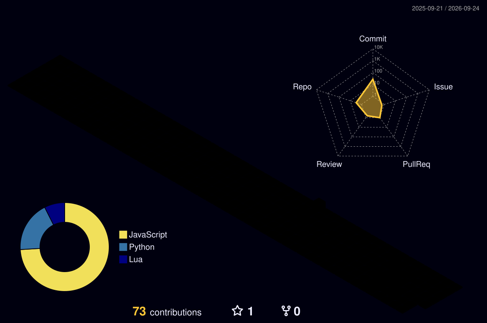

<h1 align="center">Hey, I'm Almero Badenhorst 👋</h1>
<h3 align="center">also known as Sneeuman</h3>

  

---

### 🧑‍🎓 About Me

I'm a Software Engineering student based in Bloemfontein, South Africa, currently studying and have studied:

- 🤖 **4IR Technologies** (ITTNA3)
- 🌐 **Web Development & E-Commerce** (ITECA3-12)
- 📱 **Mobile Application & Web Services / Android Development** (ITMDA3-B12)
- 🐍 **Enterprise Python Applications** (ITEPA3)
- And also doing a lot more projects 

I like building things end to end, from the database up to the UI, and I'm especially interested in how AI tools are changing software engineering as a career.

---

### 🚀 Featured Projects

#### 🛒 CashCrusaders.demo (TradeShield)
A C2C (consumer-to-consumer) e-commerce platform built for a university deliverable, where users can buy and sell goods with each other.

- Built from scratch with HTML, CSS, JavaScript, PHP, and MySQL
- Includes design diagrams, responsive prototypes, and full documentation
- ⚠️ **This is an academic mock project only.** It uses the name "CashCrusaders" because the assignment required picking a real company to theme the project around — it is **not affiliated with, endorsed by, or built for** the real Cash Crusaders. The site is not hosted live, no real payments are possible, and this is made clear on the site itself.

  

### 🛠️ Tech Stack

  

### 🌱 Currently

Growing my skills across Android development, web dev/e-commerce systems, and Python, while keeping an eye on how AI tools fit into modern software engineering workflows.

---

### 📫 Connect With Me

  

<i>Thanks for stopping by — feel free to explore my repos!</i>

---
📈 Contribution Graph (3D)

  

---
